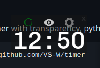

# timer
Simple countdown timer with transparency, python + pyqt5. Option to toggle "always on top" mode.

	git clone https://github.com/VS-W/timer
	cd timer
	python3 -m venv .
	source bin/activate
	pip3 install -r requirements.txt
	python3 timer.py &

Start and stop the countdown using the ⟳ button. Toggle whether the timer remains visible above all windows using the 👁 button. Click the ⚙ button to set the time, formatted as `minutes:seconds`.

When the timer has expired, click anywhere on the window to reset it.

